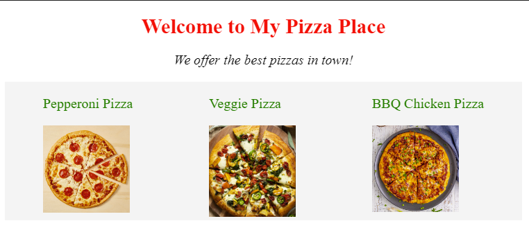

# Pizza Website CSS Makeover

Our **pizza website** looks good, but let's practice using flexbox to
align our pizzas from left to right!

### Tasks:

1. Use text-align to align the header and description to the center!
2. Use display: flex; on the pizza list.
3. Divide each pizza image and name pair into a divider.
